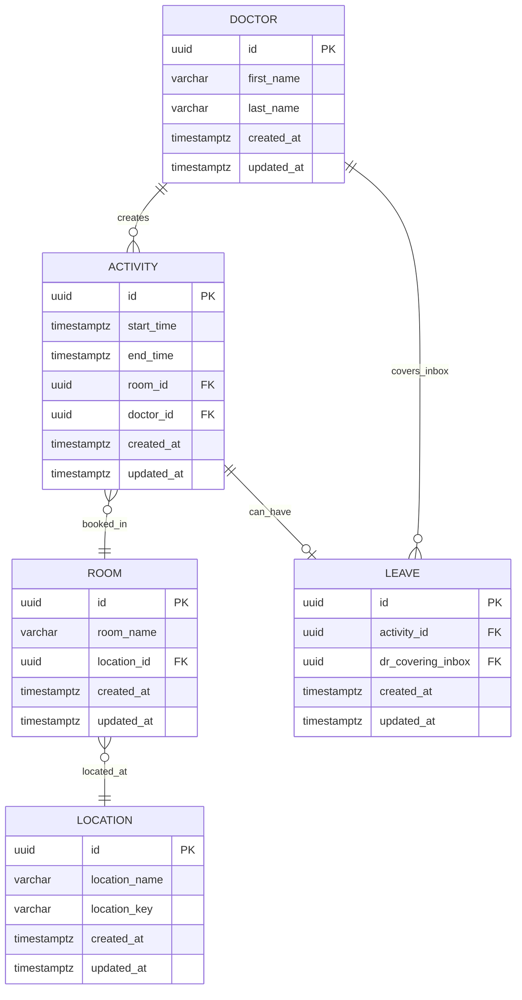
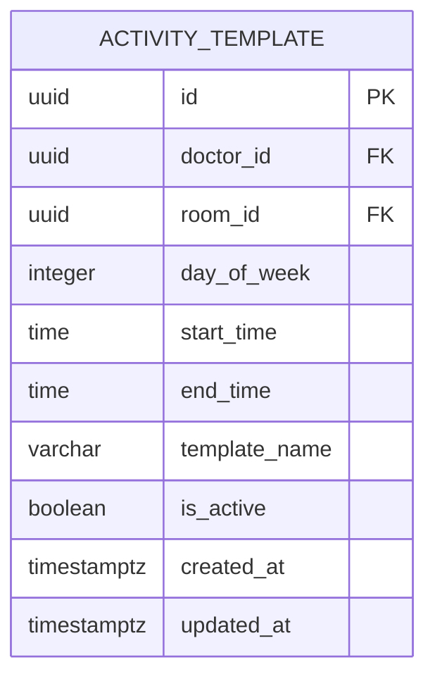
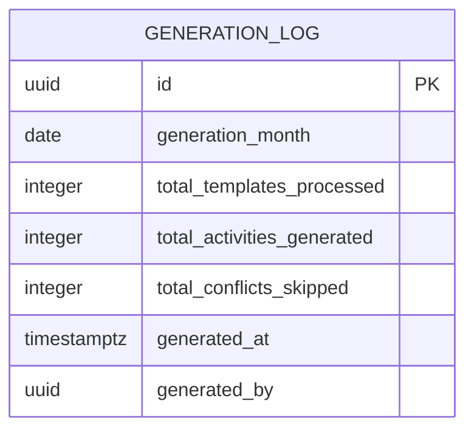
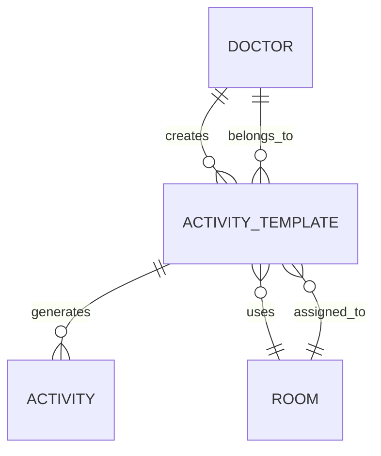

# Introduction
This is a project designed to improve the scheduling and lifecycle of contractors who choose their work schedules. 

## Problem 
Doctors at the North Shore medical centers can choose their own work schedules and vye for the times that they want to work. They currently have a bi-weekly roster that rotates, however the size of the roster is inconsequential so long as they are in weekly chunks.

The management of this schedule is the hard part. They will submit their schedules to the admin department who then make sure that each room is filled. If the doctors take leave they have to notify the admins and the admins have to find cover. Currently this is hard work - 4 excel spreadsheets are updated manually. 

We want to automate this process. 

## Solution discovery
We have isolated the flow to a very select process for now. Version one will be very basic but will allow for management of leave in an automated way.

The user flow is as follows

## Doctor (Mutations)
### Schedule
1. Create daily bookings. These are the slots they are available to see clients, generally these are 4 hour slots.
### Leave
1. Create a leave application. This will block out all activities for the day and notify the admins.

## Admin (queries)
### Schedule
1. We need to see the bookings a doctor has for a day
- This is a spreadsheet with their name at the X axis, time slots on the Y axis. The room number is also displayed for each time slot (can be different)
- If the doctor is on leave it blocks out the day for them saying LEAVE
2. We need to see if a doctor is working in the week
- This shows the rooms for the day for the doctor. Their names are at the x axis, days on the Y axis
- If the doctor is on leave it blocks out the day for them saying LEAVE
3. We need to query the activities for the room. 
- The room id is on the x axis
- The time its booked on the Y axis.
- If the room was booked but no longer, it needs to show REQUIRING COVER
4. All doctors have an email inbox. If they are away, someone needs to cover it. 
- For V1 we need to just say REQUIRING COVER when they are on leave for the day.

## Data Model

### Table Descriptions

**Doctor**: Medical professionals who book time slots
**Location**: Medical center locations (North Shore centers)
**Room**: Individual rooms within locations where doctors see patients
**Activity**: Time slots booked by doctors (typically 4-hour blocks)
**Leave**: Leave applications that block activities and require inbox coverage

## Recurring Activities System

### Overview
To handle doctors' regular weekly schedules, we implement a template-based system that generates recurring activities automatically. This prevents doctors from having to manually recreate their regular schedule each week and ensures leave applications don't affect future template-generated activities.

### Templates and Generation
- **Activity Templates**: Store recurring patterns (e.g., "Every Monday 9-1 in Room 101")
- **Monthly Generation**: Automatically generate concrete activities from templates at the start of each month
- **Conflict Resolution**: Skip template generation if room/time conflicts exist for that specific week
- **Leave Isolation**: Leave applications only affect generated activities, not the underlying templates

### Additional Tables for Recurring Activities

#### Activity Templates Table

#### Extended Activities Table
The existing activities table will be extended with:
- `template_id`: Links to the template that generated this activity (if any)
- `generation_month`: The month this activity was generated for (YYYY-MM-01 format)
- `is_template_generated`: Boolean flag indicating if this came from a template

#### Generation Logs Table (Optional)

### Updated Relationships

### Key Workflows

#### Template Creation (Doctor)
1. Doctor creates activity template specifying day of week, time, and room
2. Template remains active until manually deactivated
3. Multiple templates can be created for different days/times

#### Monthly Generation (Automated)
1. System runs at start of each month
2. Processes all active templates
3. Generates concrete activities for matching days in the month
4. Skips generation if conflicts exist (suspends for that week only)
5. Orders generated activities chronologically

#### Leave Application (Doctor)
1. Leave applications work on generated activities as normal
2. Template remains unaffected
3. Future months continue to generate from template
4. Shows "REQUIRING COVER" for affected activities
